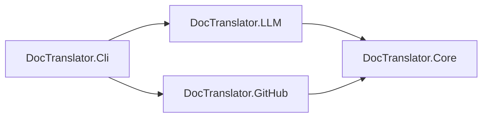
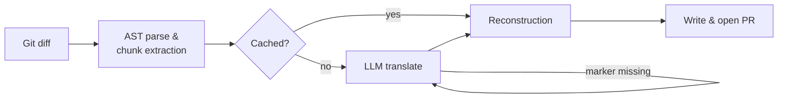

# Architecture

`doc-translator-action` is a .NET 9 GitHub Action split into four layers, each with a single responsibility and a strict dependency direction: `Cli` depends on `LLM` and `GitHub`, both of which depend on `Core`, and `Core` depends on nothing outside the .NET BCL and Markdig.



## Why an AST, not regex

Markdown translation tools that operate on raw text or regular expressions eventually mistranslate something inside a code fence, mangle a URL, or drift a closing tag out of position. `doc-translator-action` instead parses every source file into a real Abstract Syntax Tree via [Markdig](https://github.com/xoofx/markdig), so "is this text translatable" is a question the parser already answered - not a pattern we're guessing at.

## The pipeline



1. **Git diff** (`DocTranslator.GitHub`) - `LibGit2Sharp` diffs the triggering commit against its base, filtered by `include-glob` and `.doc-ignore`, so only files that actually changed are parsed at all.
2. **AST parse & chunk extraction** (`DocTranslator.Core`) - `MarkdigParserService` walks the AST and extracts one `TranslationChunk` per translatable leaf block (paragraph, heading, table cell, list item, blockquote). Within a chunk, non-text inlines (code spans, autolinks, raw HTML, line breaks) become atomic placeholder tokens like `⟦CODE0⟧`, and inlines whose *children* are translatable but whose wrapper carries metadata (emphasis, links) become paired tags like `<em0>...</em0>`. Code blocks, raw HTML blocks, and a leading YAML or TOML frontmatter block are skipped entirely and never touched - frontmatter is captured verbatim (delimiters included) and spliced back onto the output ahead of everything else, since it must stay the file's first bytes for a static site generator to recognize it (and, for YAML, since Markdig's renderer doesn't round-trip it correctly anyway). TOML has no native Markdig support at all, so it's stripped from the raw text before Markdig ever parses it; YAML frontmatter is recognized by Markdig itself and removed from the parsed tree afterward. Docusaurus/MyST-style `::: note ... :::` admonitions are recognized too (via Markdig's CustomContainers extension) - only the content inside is translated, never the fence line; a custom `NormalizeRenderer` object-renderer (`CustomContainerNormalizeRenderer`) re-emits the fence on output, since Markdig doesn't ship one itself. When `translate-mermaid-diagrams` is on, a ```` ```mermaid ```` fenced block's `flowchart`/`graph` diagrams get their node/edge/subgraph text labels extracted by `MermaidLabelExtractor` (pattern-based, not a full mermaid parser) as their own chunks - each label is translated exactly like any other chunk, then spliced back into a copy of the block's raw text and found/replaced in the rendered document, since mermaid content has no Markdig Inline tree to splice into the normal way. Other diagram types and PlantUML are left untouched.
3. **LLM translation** (`DocTranslator.LLM`) - chunks are batched and sent to whichever provider is configured (Gemini, OpenAI, Claude, or Azure OpenAI - all four wrapped behind `Microsoft.Extensions.AI`'s `IChatClient`, via each vendor's official SDK) with structured JSON output, so the response is `{chunkId, translatedText}` pairs, not free text to parse.
4. **Self-healing reconstruction** (`DocTranslator.Core`) - `AstReconstructor` verifies every placeholder/tag from step 2 survived the translation. If one didn't, that single chunk is re-translated with a repair prompt (up to 2 attempts) before falling back to leaving just that paragraph untranslated - one bad response never corrupts the document or aborts the file. Chunks are spliced back into the exact AST node they came from and the document is re-rendered to Markdown.
5. **Write & publish** (`DocTranslator.GitHub`) - translated files are written to the configured `output-path-template`, committed to a branch keyed to the triggering commit SHA (idempotent re-runs), and a pull request is opened (or an existing one for the same commit is reused) with a summary comment. With `push-to-current-branch: true`, this step is skipped entirely in favor of committing straight onto whatever branch the job already has checked out - no new branch, no Octokit PR call at all (see `GitWriter.CommitAndPushToCurrentBranch` and the README's ChatOps recipe).

## Cost & reliability controls

- **Content-hash translation cache** - each chunk's `ContentHash` (SHA-256 of its placeholder-encoded text) is checked against a per-file, per-language cache before hitting the LLM. Unrelated edits elsewhere in a file never invalidate untouched paragraphs.
- **Concurrency** - batches for one file/language translate concurrently, bounded by `max-parallel-requests` via a `SemaphoreSlim`.
- **Resilience** - transient HTTP failures (429/5xx) are retried with Polly v8 exponential backoff, independent of the semantic retry that repairs malformed JSON or missing markers.
- **Drift detection** - every translated file carries an HTML-comment provenance header (source content hash + timestamp). A later run flags any translation whose source has since changed without a corresponding re-translation.
- **No self-translation** - that same provenance header doubles as a "this file is generated output" marker: any changed file that starts with it is skipped as a source, regardless of `output-path-template` shape, so a translation this action wrote can never be picked back up and re-translated on a later run.

## Configuration precedence

Every setting resolves in the same order regardless of source: an explicit CLI flag wins, then the matching `INPUT_*` Action input, then the optional `config-path` JSON file, then a built-in default. This lets a single `config-path` file hold repo-wide defaults while any individual workflow run still overrides one value without editing it.

## Observability

Every run produces: a GitHub Actions Job Summary (`GITHUB_STEP_SUMMARY`) with per-language chunk/cache counts and token usage, `::group::`/`::warning::`/`::error::` workflow-command annotations for per-file processing and glossary/reconstruction issues, and a PR comment (`PrSummaryBuilder`) summarizing the same plus a count of code blocks/links/glossary terms preserved untouched, a mention of the triggering `GITHUB_ACTOR`, and a side-by-side original/translated preview (first 3 chunks per file, capped at 5 file/language pairs) in a collapsible `<details>` block, so a reviewer can sanity-check quality without opening every file.

## Solution layout

| Project | Responsibility |
| --- | --- |
| `DocTranslator.Core` | AST parsing/reconstruction, glossary, `.doc-ignore`, drift detection, token usage tracking - no network/API dependencies |
| `DocTranslator.LLM` | Multi-provider translation via `IChatClient`, resilience, batching, chunk repair |
| `DocTranslator.GitHub` | Git diff analysis, translation cache, PR creation via LibGit2Sharp + Octokit |
| `DocTranslator.Cli` | DI wiring, input binding, orchestration pipeline, `System.CommandLine` entrypoint |
